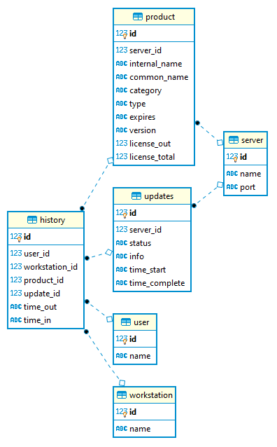

ArcGIS License Tracker
============
ArcGIS License Tracker is a tool to display current and historical license usage from a concurrent use (floating) license server.

## Features
* Access current and historical license usage through the browser
* Export license data - users, products and workstations to multiple file formats. 
* Support for multiple license servers

## Requirements
 * Python >= 3.6
 * Windows OS
 * Local access to the `lmutil.exe` included with the license server. The default location of this command line tool is in `C:\Program Files (x86)\ArcGIS\LicenseManager\bin\`.

## Getting Started

1. Clone the repo
    ```
    > git clone https://github.com/ishiland/arcgis-license-tracker.git
    > cd arcgis-license-tracker
    ```

2. Initialize and activate a virtualenv:
    ```
    > python -m virtualenv venv
    > venv\Scripts\activate
    ```

3. Install the dependencies:
    ```
    > pip install -r requirements.txt
    ```

4. In `app/arcgis_config.py`, configure the following:
    * `license_servers` - List of license servers to track. The default port is 27000.
    * `lm_util` - Path to your lmutil.exe. 
    
5. Initialize the database
    
    Initialize the database using:
    ```
    > python manage.py recreate_db
    ```

6. Test your license server configuration:
    ```
    > python manage.py read_once
    ```
    Make sure there are no errors at this step.
  
7. Run the development server:
    ```
    > python manage.py runserver
    ```

8. Navigate to [http://localhost:5000](http://localhost:5000)

## Production
After successfully testing in development, set the `FLASK_ENV` variable to `production` then initialize a production database using `python manage.py recreate_db`.

### Task Scheduler
Setup a scheduled task to read license data at your desired intervals. The `read_once` command has been tested to run every minute without any issues.  

In Task Scheduler, you will want to configure the 'Action' similiar to this:
 - *Program/script*: path the to python executable in your virtual environment
 - *Add arguments:* `manage.py read_once`
 - *Start in*: The root directory of the application where the `manage.py` file is.  Ex. `C:\inetpub\wwwroot\arcgis-license-tracker\`

### Deploy
Deploy to a production web server. Here are some helpful guides and tools for deploying to IIS:
 - [GitHub Gist](https://gist.github.com/bparaj/ac8dd5c35a15a7633a268e668f4d2c94)
 - [wfastcgi](https://pypi.org/project/wfastcgi/)
 
There is also a sample web.config for reference included in this repo. A summary of other deployment options [here](https://flask.palletsprojects.com/en/1.1.x/deploying/).

## Tests
Tests can be ran using `python manage.py test`

## Further Thoughts
 - It would be good to have this running with a library like [ApScheduler](https://github.com/agronholm/apscheduler) for ease of setup but I ran out of time trying to get it working in production w/IIS.  Windows Task Scheduler is an extra step but seems to work fine. 
 - The database design is as follows:
    
   